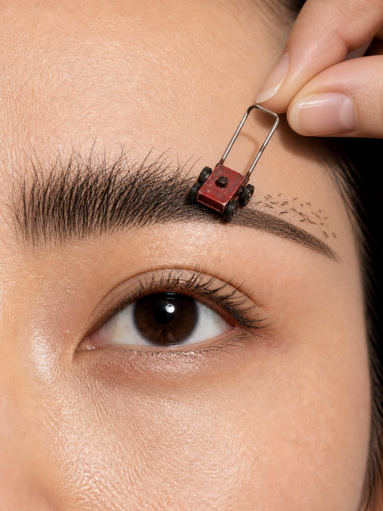
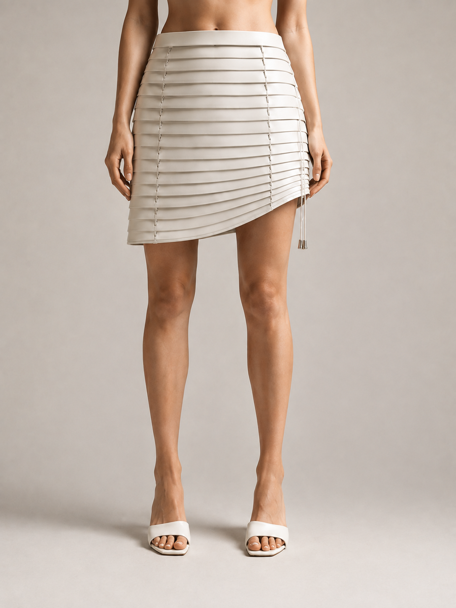
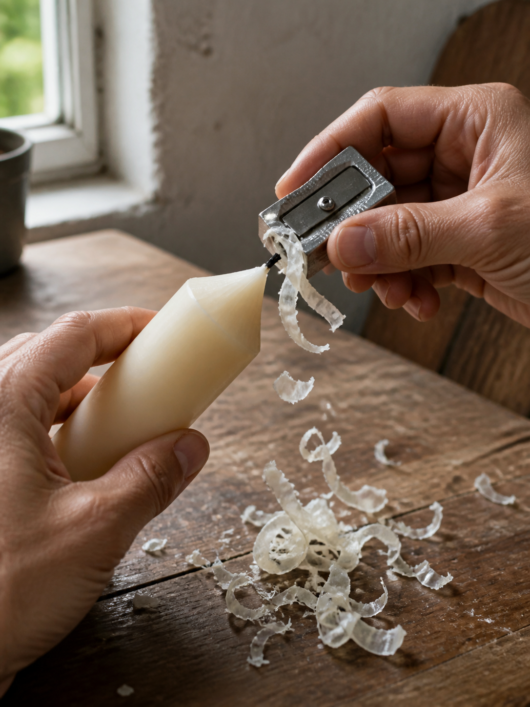
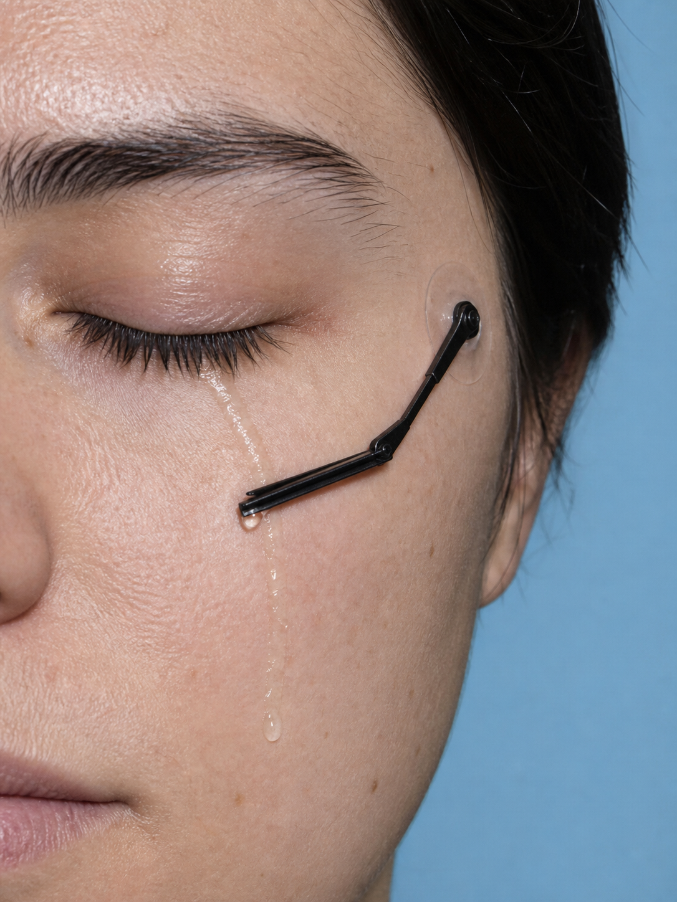

# 概念摄影计划 / Conceptual Photography Plan

`conceptual-photography-plan` 是一个面向 Codex 的原创概念摄影 Skill。它可以根据一个词、一个具体物件、一张素材图或一个主题，扩展候选创意，筛掉牵强和物理上不成立的方案，并默认直接生成对应的写实图片。

`conceptual-photography-plan` is a Codex Skill for creating original conceptual photography. Starting from a word, a specific object, a reference image, or a theme, it expands possible concepts, filters out forced or physically implausible ideas, and generates a corresponding photorealistic image by default.

它不追求把两个形状相似的东西简单拼在一起，而是寻找一条真正成立的新关系：物件仍然能够被认出，原有功能或动作仍然有效，连接、承重、路径、光线和场景也经得起检查。

Rather than simply combining two similarly shaped objects, it looks for a genuinely meaningful new relationship: the object remains recognizable, its original function or action still works, and every connection, load-bearing structure, path, light source, and scene detail withstands scrutiny.

> **一句话目标：**让荒诞只发生在 10% 的关键关系上，其余 90% 都像真实世界。<br>
> **In one sentence:** Keep the surrealism within the crucial 10% of the relationship, while the other 90% remains grounded in reality.

## 示例作品 / Example Works

<table>
  <tr>
    <td width="33%" align="center">
      <br>
      <strong>倒带马尾 / Rewind Ponytail</strong><br>
      磁带盒保留卷带结构，磁带成为能够被“倒带”的马尾。<br>
      The cassette retains its winding mechanism, while the tape becomes a ponytail that can literally be rewound.
    </td>
    <td width="33%" align="center">
      <br>
      <strong>眉毛草坪 / Eyebrow Lawn</strong><br>
      微型割草机沿眉毛行进，接触点与修剪结果同时可见。<br>
      A miniature lawn mower travels along an eyebrow, showing both the point of contact and the trimmed result.
    </td>
    <td width="33%" align="center">
      <br>
      <strong>百叶裙 / Venetian-Blind Skirt</strong><br>
      百叶窗保留叶片、梯绳和拉绳系统，接管裙摆的开合功能。<br>
      The blinds retain their slats, ladder cords, and pull-cord system, taking over the opening and closing function of a skirt.
    </td>
  </tr>
  <tr>
    <td width="33%" align="center">
      <br>
      <strong>削亮一支蜡烛 / Sharpen a Candle</strong><br>
      卷笔刀真实削动蜡烛，削屑、刀口和烛芯形成完整动作证据。<br>
      A pencil sharpener genuinely shaves the candle, with the shavings, blade, and wick forming a complete chain of visual evidence.
    </td>
    <td width="33%" align="center">
      <br>
      <strong>给眼泪装雨刷 / A Wiper for Tears</strong><br>
      外贴式微型雨刷沿泪痕工作，把“擦去眼泪”变成真实机械动作。<br>
      A tiny externally mounted wiper follows a tear trail, turning “wiping away tears” into a real mechanical action.
    </td>
    <td width="33%" align="center">
      <br>
      <strong>给苹果开瓶 / Uncork an Apple</strong><br>
      开瓶器旋入带果皮的苹果芯，完整保留旋入、受力和提拉路径。<br>
      A corkscrew twists into a skin-covered apple core, preserving the complete sequence of insertion, leverage, and extraction.
    </td>
  </tr>
</table>

这些案例分别使用了动作错置、功能替身和尺度转换，但都遵守同一原则：**不是借外形做装饰，而是让功能、动作和结果共同成立。**

These examples use displaced actions, functional substitution, and scale shifts, but all follow the same principle: **form is not decoration; function, action, and result must work together.**

## 它能做什么 / What It Can Do

- **指定元素创意 / Element-based concepts:** 输入香蕉、玫瑰、梳子、蜡烛等元素，生成彼此不同的原创方向。<br>Start with an element such as a banana, rose, comb, or candle and generate genuinely distinct original directions.
- **主题创意 / Theme-based concepts:** 围绕爱情、情人节、孤独、时间等主题，寻找可被单帧照片直接表达的关系。<br>Explore themes such as love, Valentine’s Day, loneliness, or time through relationships that can be communicated in a single photograph.
- **素材图驱动 / Reference-image driven:** 先从参考图中判断能否提取结构完整、功能明确的“物件锚点”；有锚点时优先保留其真实结构和功能，无法提取时才退回纯风格参考。<br>First determine whether the image contains a structurally complete, functional “object anchor.” Preserve its real structure and function whenever possible; use the image only as a style reference when no suitable anchor can be extracted.
- **场景改造 / Scene transformation:** 保留原图约 80%–90% 的空间、人物、透视和光线，只改变一个关键关系。<br>Preserve roughly 80%–90% of the original space, people, perspective, and lighting while changing only one crucial relationship.
- **逻辑校对 / Logic review:** 检查连接点、承重、铰链、工具方向、液体路径、开合方式、投影和动作因果。<br>Check connection points, load bearing, hinges, tool orientation, liquid paths, opening mechanisms, shadows, and cause-and-effect.
- **连续迭代 / Continuous iteration:** 理解“下一个”“继续”“pass”“保留人物，只改道具”等短反馈，并锁定未被点名的部分。<br>Understand short feedback such as “next,” “continue,” “pass,” or “keep the person and change only the prop,” while locking all untouched elements.
- **直接生成图片 / Direct image generation:** 默认同时交付筛选后的创意和对应图片，不需要另外补充“出图”。<br>Deliver the selected concept and its image together by default, without requiring a separate request to generate it.

## 核心方法 / Core Method

### 1. 先找共享动词 / Start with a Shared Verb

一个创意至少需要：

Every concept needs at least:

```text
原物件 + 意外目标 + 双方共享的真实动作
Original object + unexpected target + a real action shared by both
```

例如，割草机与眉毛共享“修剪”，雨刷与眼泪共享“擦除”，开瓶器与苹果共享“旋入并提起”。只有颜色、轮廓或大小相似，而没有共享动作的组合会被优先淘汰。

For example, a lawn mower and an eyebrow share “trimming”; a windshield wiper and tears share “wiping away”; a corkscrew and an apple share “twisting in and lifting out.” Combinations based only on similar color, silhouette, or scale—without a shared action—are rejected first.

### 2. 先否决，再评分 / Reject First, Then Score

候选必须先通过物件辨识、动作完整、天然功能联系、物理闭环、摄影美感和原创距离六项硬门槛；任何关键结构不成立，都不能靠高概念分补救。

Every candidate must pass six hard gates: object recognition, action completeness, a natural functional connection, physical closure, photographic beauty, and originality. A broken critical structure cannot be rescued by a high concept score.

通过硬门槛后，再按以下权重选优：

Candidates that pass are ranked using these weights:

- 观念新鲜度 / Conceptual freshness: 40%
- 情绪或含义 / Emotion or meaning: 20%
- 视觉冲击力 / Visual impact: 10%
- 一眼可读性 / Immediate readability: 10%
- 原创距离 / Originality distance: 10%
- 可拍摄性 / Practical shootability: 10%

### 3. 把创意变成单帧证据 / Turn the Concept into Single-Frame Evidence

最终画面需要让观众依次看到：

The final image should guide the viewer through this sequence:

```text
原物件身份 → 接触或连接 → 变化结果
Original object → contact or connection → visible result
```

如果画面必须依赖标题才能看懂，或者只能被描述成“把某物放在某处”，该构图不会进入生成阶段。

If the image depends on a title to make sense, or can only be described as “an object placed somewhere,” the composition does not proceed to generation.

## 安装 / Installation

### 方法一：让 Codex 安装（推荐）/ Option 1: Ask Codex to Install It (Recommended)

在 Codex 中发送：

Send this message in Codex:

```text
使用 $skill-installer，从 https://github.com/natsany/conceptual-photography-plan 安装这个 Skill。

Use $skill-installer to install this Skill from https://github.com/natsany/conceptual-photography-plan.
```

安装完成后，在下一轮对话或新任务中调用即可。

After installation, invoke it in your next conversation turn or in a new task.

### 方法二：使用 Git 克隆 / Option 2: Clone with Git

#### Windows PowerShell

```powershell
$skillRoot = if ($env:CODEX_HOME) {
    Join-Path $env:CODEX_HOME 'skills'
} else {
    Join-Path $env:USERPROFILE '.codex\skills'
}

New-Item -ItemType Directory -Path $skillRoot -Force | Out-Null
git clone https://github.com/natsany/conceptual-photography-plan.git `
    (Join-Path $skillRoot 'conceptual-photography-plan')
```

#### macOS / Linux

```bash
skill_root="${CODEX_HOME:-$HOME/.codex}/skills"
mkdir -p "$skill_root"
git clone https://github.com/natsany/conceptual-photography-plan.git \
  "$skill_root/conceptual-photography-plan"
```

安装目录中应直接包含 `SKILL.md`：

The installation directory should contain `SKILL.md` at its root:

```text
conceptual-photography-plan/
├── SKILL.md
├── agents/
│   └── openai.yaml
└── references/
    ├── calibration.md
    ├── logic-audit.md
    └── prompt-patterns.md
```

> 默认安装位置是 `$CODEX_HOME/skills`；未设置 `CODEX_HOME` 时使用 `~/.codex/skills`。安装后请新开一个任务，让 Codex 重新加载 Skill。<br>
> The default installation path is `$CODEX_HOME/skills`; if `CODEX_HOME` is not set, `~/.codex/skills` is used. After installation, start a new task so Codex can reload the Skill.

## 使用方法 / Usage

在提示词中明确写出 `$conceptual-photography-plan`，再提供元素、主题或素材图。

Explicitly include `$conceptual-photography-plan` in your prompt, then provide an element, theme, or reference image.

### 根据一个元素生成两个创意和图片 / Generate Two Concepts and Images from One Element

```text
使用 $conceptual-photography-plan，根据香蕉做2个新创意。

Use $conceptual-photography-plan to create two new concepts based on a banana.
```

### 根据主题生成指定数量的创意 / Generate a Specified Number of Concepts from a Theme

```text
使用 $conceptual-photography-plan，根据“情人节”做4个创意并直接出图。

Use $conceptual-photography-plan to create four concepts based on “Valentine’s Day” and generate the images directly.
```

### 使用素材图 / Use a Reference Image

先上传图片，再发送：

Upload the image first, then send:

```text
使用 $conceptual-photography-plan，用这张素材图测试，筛选最佳创意并直接生成3:4图片。

Use $conceptual-photography-plan with this reference image, select the strongest concept, and generate a 3:4 image directly.
```

Skill 会先判断素材图是编辑目标、场景底图、物件锚点还是纯风格参考，不会因为用户说了“参考图”就直接复制原图构图。

The Skill first determines whether the image is an edit target, a scene base, an object anchor, or a pure style reference. Calling it a “reference image” does not cause the original composition to be copied automatically.

### 精准修改当前图片 / Make a Precise Edit to the Current Image

```text
保留人物、场景和光线，只把雨刷改成外贴式微型道具。

Keep the person, scene, and lighting unchanged. Replace only the wiper with a tiny externally mounted prop.
```

简短反馈默认修改当前选中图片；未被点名的构图、人物、材质和光线会尽量保持不变。

Short feedback applies to the currently selected image by default. Unmentioned elements—including composition, people, materials, and lighting—remain locked whenever possible.

### 只看创意，不生成图片 / Review Concepts Without Generating Images

```text
使用 $conceptual-photography-plan，根据玫瑰做2个新创意。只要方案，不要出图。

Use $conceptual-photography-plan to create two new concepts based on a rose. Show concepts only; do not generate images.
```

## 默认输出 / Default Output

- 只指定一个元素且未写数量时：默认给出 **2 个不同创意 + 2 张对应图片**。<br>When one element is provided without a quantity, the default output is **2 distinct concepts + 2 corresponding images**.
- 上传素材图并说“用这个试试”时：默认筛选 **1 个最佳方向 + 1 张图片**。<br>When a reference image is uploaded with a request such as “try this,” the default output is **1 strongest direction + 1 image**.
- 指定数量时：每个创意分别生成一张图，不用拼贴代替多张成图。<br>When a quantity is specified, each concept receives its own image; a collage is never used as a substitute for separate outputs.
- 默认画幅：竖版 **3:4**、全画幅、无白边、无圆角。<br>Default format: vertical **3:4**, full-bleed, with no white border or rounded corners.
- 默认风格：写实摄影；动作型概念优先真实场景与自然光。<br>Default style: photorealistic photography; action-based concepts favor real-life settings and natural light.
- 每张图只保留一个异常关系，不添加解释文字、箭头、标签或魔法光效。<br>Each image contains only one anomalous relationship, with no explanatory text, arrows, labels, or magical effects.

## 适合的任务 / Best Suited For

- 原创概念摄影与视觉隐喻 / Original conceptual photography and visual metaphors
- 广告创意、编辑摄影、社交媒体视觉 / Advertising concepts, editorial photography, and social-media visuals
- 从参考图提取机制但避免近似抄袭 / Extracting mechanisms from references without producing close imitations
- 对 AI 成图进行结构、动作和物理合理性校对 / Reviewing AI-generated images for structural, functional, and physical plausibility
- 连续产出一组机制不同、视觉语言统一的作品 / Producing a visually coherent series built from distinct mechanisms

它不是一个“随机拼贴器”。如果创意无法在一句话内说清、无法在一秒内识别，或现实结构无法闭环，它会优先换方向，而不是用复杂说明替画面辩护。

This is not a “random collage generator.” If a concept cannot be explained in one sentence, recognized in one second, or built with a physically complete real-world structure, the Skill changes direction instead of defending a weak image with a complicated explanation.
